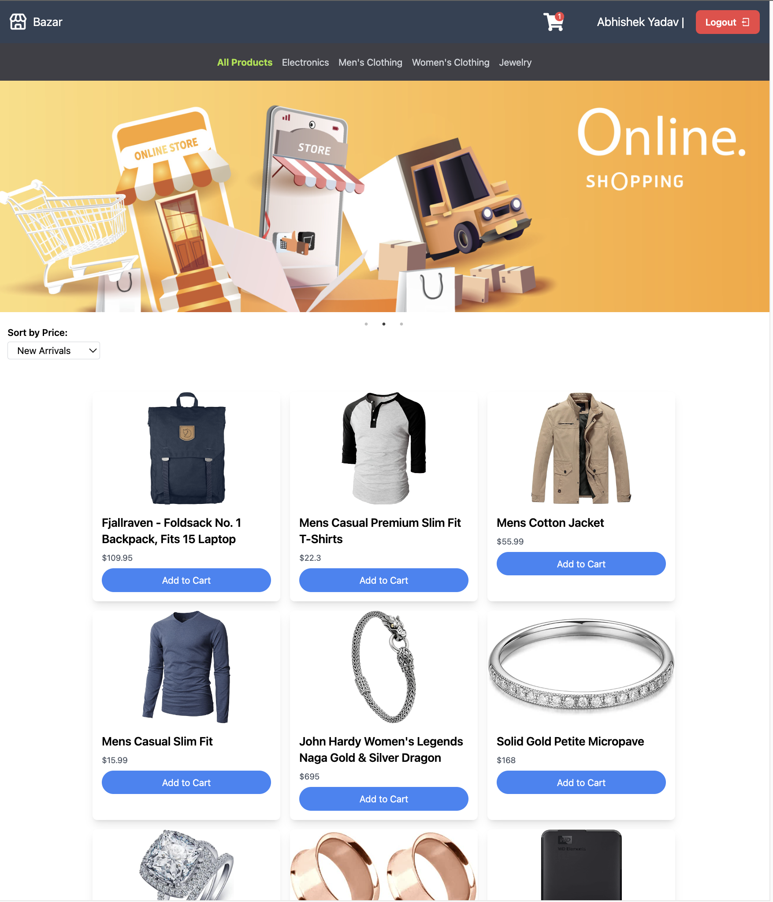

React Ecommerce Project

## Project Overview

This project is a web-based ecommerce application that allows users to browse, search for, and purchase products online. Users can create accounts, add items to their shopping cart, and securely checkout using Auth0 for authentication. Redux Toolkit is used for state management to ensure a smooth and efficient shopping experience.

## Technologies Used

- React: A JavaScript library for building user interfaces.
- Tailwind CSS: A utility-first CSS framework for building responsive and visually appealing designs.
- JavaScript: The primary programming language used in this project.
- Auth0: A secure authentication and authorization platform.
- Redux Toolkit: A library for efficient state management in React applications.

## License

This project is licensed under the [MIT License](LICENSE).

---

Feel free to modify this README template to suit your application's specific details and requirements. Good luck with your Thread-Clone application! If you have any questions, feel free to reach out.

# ecommerce
