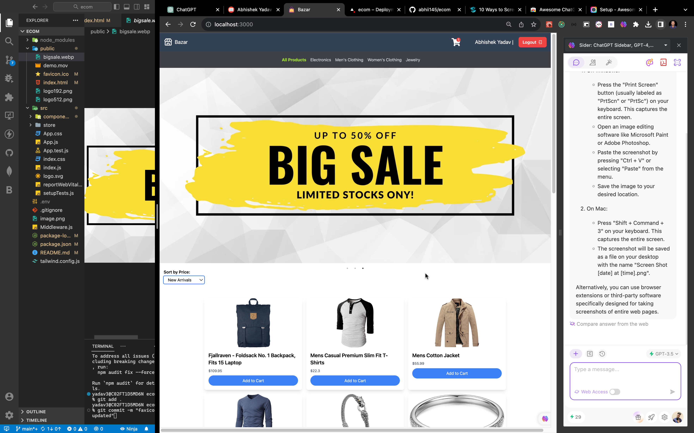

React Ecommerce Project

Welcome to the React Ecommerce Project repository! This project is a web-based ecommerce application built using React, Tailwind CSS, JavaScript, Auth0, and Redux Toolkit. This README will provide you with all the necessary information to get started, set up the project, and start developing.

Project Overview
This project is a web-based ecommerce application that allows users to browse, search for, and purchase products online. Users can create accounts, add items to their shopping cart, and securely checkout using Auth0 for authentication. Redux Toolkit is used for state management to ensure a smooth and efficient shopping experience.

Technologies Used
React: A popular JavaScript library for building user interfaces.
Tailwind CSS: A utility-first CSS framework for building responsive and visually appealing designs.
JavaScript: The primary programming language used in this project.
Auth0: A secure authentication and authorization platform.
Redux Toolkit: A library for efficient state management in React applications.
